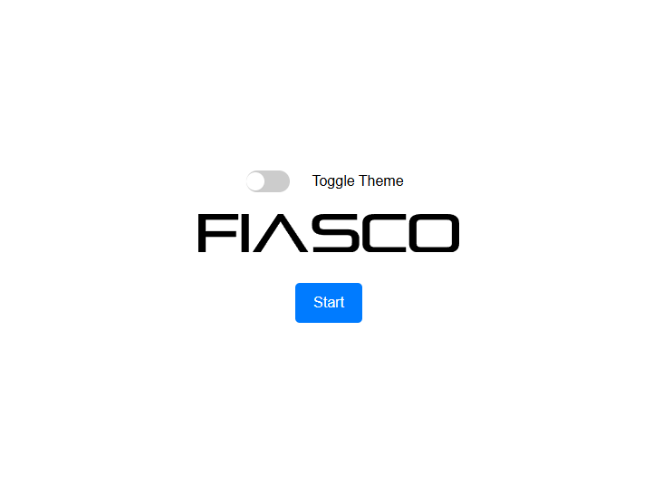
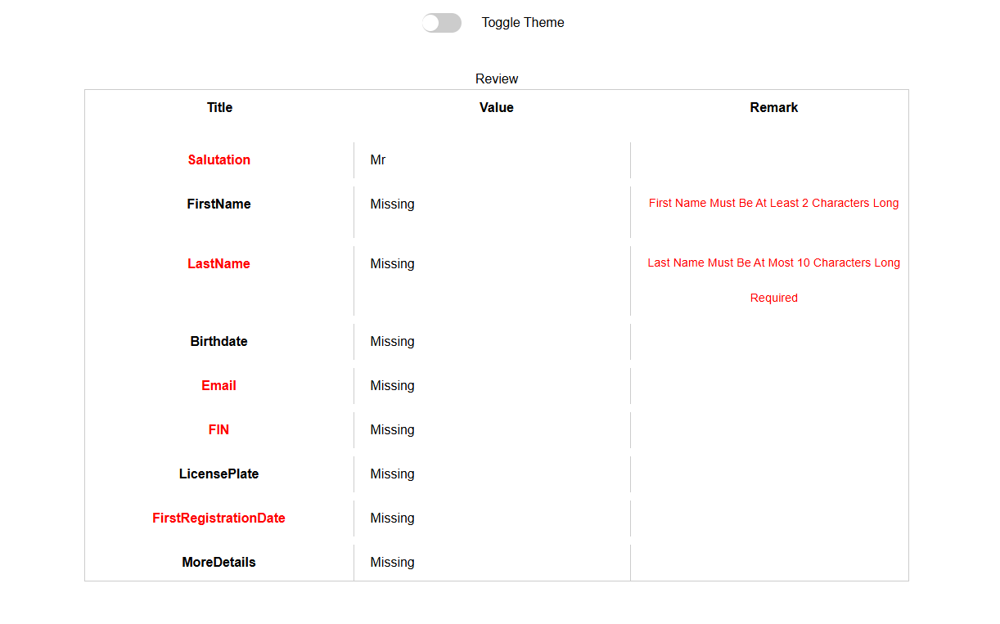

# Form Generator

This project is a dynamic form generator built with React and TypeScript. It allows for the creation of forms based on a JSON configuration file (`pages.json`).


## Project Structure

The project follows a consistent naming convention using `kebab-case` for folder and file names. Below is an overview of the folder structure:
```
src/
├── components/
│   ├── field-renderer.tsx
│   ├── form-generator.tsx
│   └── toggle.tsx
├── config/
│   └── pages.ts (just one place to import pages.json)
├── context/
│   ├── form-context.tsx
│   └── theme-context.tsx
├── hooks/
│   └── conditional-nav.ts
├── models/
│   └── interfaces.ts
├── pages/
│   ├── welcome.tsx
│   └── review.tsx
├── styles/
│   └── form-generator.css
├── utils/
│   ├── evaluate_conditions.ts
│   ├── validate_field.ts
│   └── handle_submit.ts
├── App.tsx
├── index.tsx
├── pages.json
└── style-config.json
```

## Node Version
```
16.13.0
```

## Installation

To install the project dependencies, run:

```sh
npm install
```

## Running the Project

To start the development server, run:

```sh
npm start
```

## Components

### FieldRenderer

The `FieldRenderer` component is responsible for rendering different types of form fields based on the configuration provided in the `pages.json` file.

### GenerateForm

The `GenerateForm` component handles the form generation logic, including conditional navigation and form submission.

## Context

### FormDataContext

The `FormDataContext` provides the form data and navigation functions to the components.

### ThemeContext

The `ThemeContext` provides theming information to style the form components.

## Hooks

### useConditionalNavigation

The `useConditionalNavigation` hook handles the conditional navigation logic based on the form data and the conditions specified in the `pages.json` file.

## Models

### Interfaces

The `interfaces` file contains the TypeScript interfaces used throughout the project.

## Utilities

### evaluateConditions

The `evaluateConditions` utility function evaluates the conditions specified in the `pages.json` file to determine whether a page should be displayed.

### handleSubmit

The `handleSubmit` utility function handles the form submission logic, including validation and data aggregation.

## Pages

### WelcomePage

The `WelcomePage` component renders the welcome page of the form.


### ReviewPage

The `ReviewPage` component renders the review page, displaying all the form data for final review before submission.

## Styles

The project uses CSS files asn `tailwind` for styling the form components.

## Configuration

### pages.json

The `pages.json` file contains the configuration for the form pages, including fields, buttons, and conditional logic.

### style-config.json
For the styling I implemented two themes: `light` and `dark`. And a toggle button to switch between them.

The `style-config.json` file contains the theming information used by the `ThemeContext`.


## Notes:
- I used FIASCO SVG out of the web for the logo. 
- In order to edit the form, you can change the `pages.json` file, and the form will be updated accordingly. Just make sure to follow the structure of the JSON file which can be found in the `models` folder.
- For the validations I relied on regex to handle things like minimum and maximum length, email... , pastOnly for the dates and required fields.
- Please don't mind my design skills, I'm a software engineer not a designer 😅.